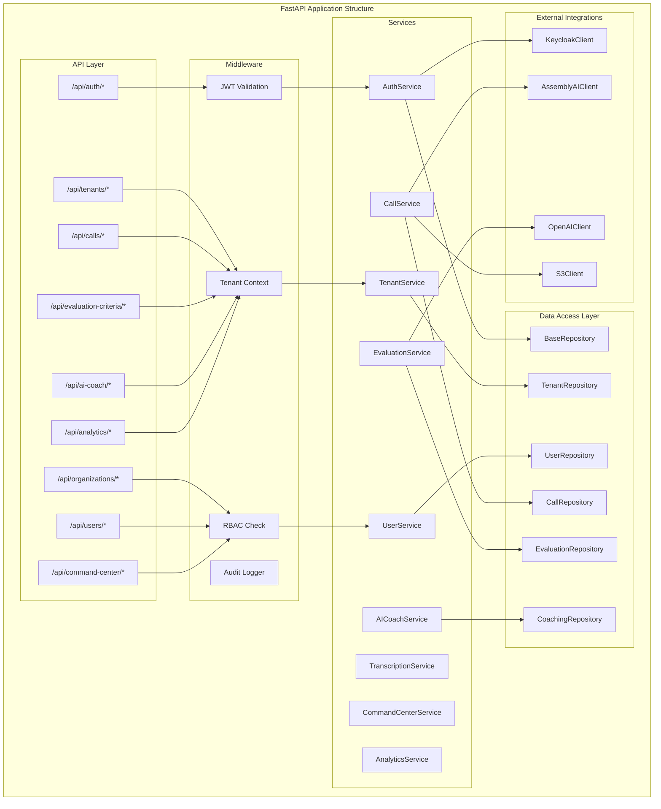
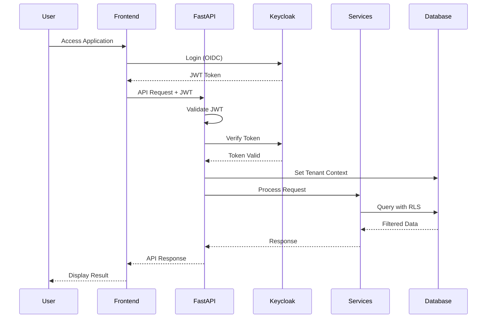
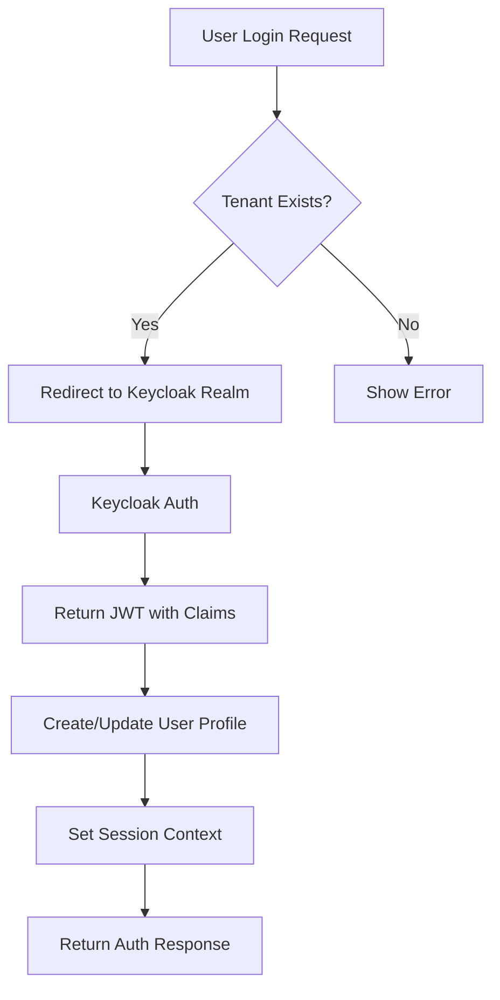
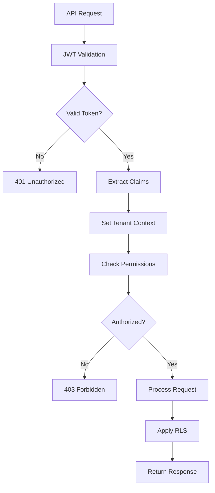
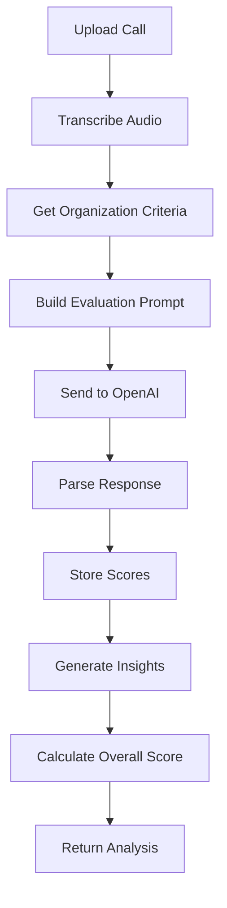
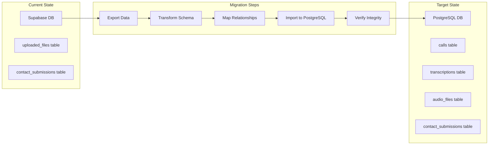
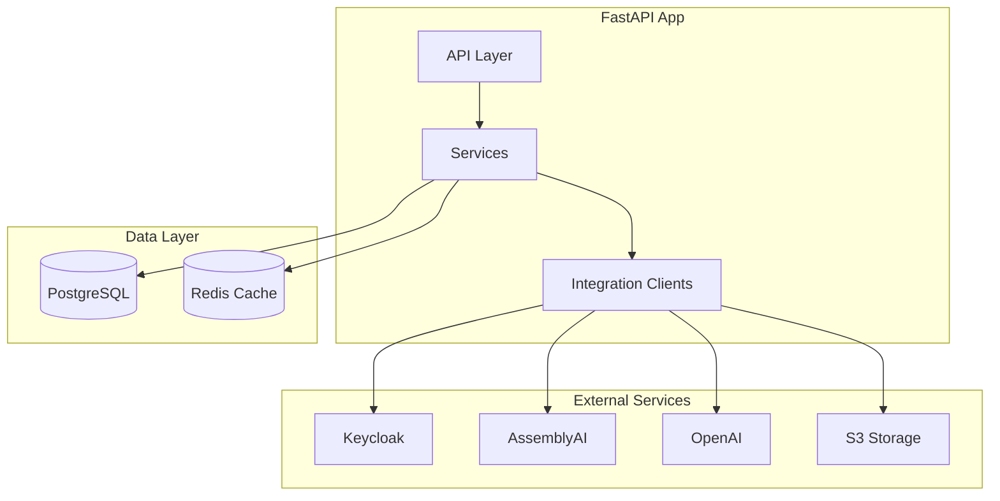

# Implementation Roadmap - Multi-Tenant QA Platform

## High-Level Implementation Flow

```mermaid
graph LR
    subgraph "Phase 1: Foundation"
        A1[Database Setup] --> A2[Keycloak Integration]
        A2 --> A3[Base Services]
        A3 --> A4[Auth Middleware]
    end
    
    subgraph "Phase 2: Core Migration"
        B1[Models & Schemas] --> B2[Auth Service]
        B2 --> B3[Tenant Service]
        B3 --> B4[Call Management]
        B4 --> B5[Evaluation Service]
    end
    
    subgraph "Phase 3: Advanced Features"
        C1[AI Coach Service] --> C2[Command Center]
        C2 --> C3[Analytics Service]
        C3 --> C4[Reporting Engine]
    end
    
    A4 --> B1
    B5 --> C1
```



## Detailed Component Architecture



## Implementation Sequence



## File Structure to Create

```
fastapi_app/
├── core/
│   ├── __init__.py
│   ├── config.py              # Settings with Pydantic
│   ├── database.py            # Database connection & session
│   ├── security.py            # JWT & permission helpers
│   └── exceptions.py          # Custom exceptions
│
├── models/
│   ├── __init__.py
│   ├── base.py                # Base SQLAlchemy models
│   ├── tenant.py              # Tenant & Organization models
│   ├── user.py                # User & Agent models
│   ├── call.py                # Call & Transcription models
│   ├── evaluation.py          # Evaluation criteria & scores
│   ├── coaching.py            # AI Coach models
│   └── analytics.py           # Analytics & reporting models
│
├── schemas/
│   ├── __init__.py
│   ├── auth.py                # Auth request/response schemas
│   ├── tenant.py              # Tenant schemas
│   ├── user.py                # User schemas
│   ├── call.py                # Call schemas
│   ├── evaluation.py          # Evaluation schemas
│   ├── coaching.py            # Coaching schemas
│   └── analytics.py           # Analytics schemas
│
├── services/
│   ├── __init__.py
│   ├── base_service.py        # Base service class
│   ├── auth_service.py        # Authentication logic
│   ├── tenant_service.py      # Tenant management
│   ├── user_service.py        # User management
│   ├── call_service.py        # Call processing
│   ├── evaluation_service.py  # QA evaluation
│   ├── coaching_service.py    # AI Coach logic
│   ├── command_service.py     # Command center
│   └── analytics_service.py   # Analytics processing
│
├── repositories/
│   ├── __init__.py
│   ├── base_repository.py     # Base repository pattern
│   ├── tenant_repository.py   # Tenant data access
│   ├── user_repository.py     # User data access
│   ├── call_repository.py     # Call data access
│   ├── evaluation_repository.py
│   └── coaching_repository.py
│
├── api/
│   ├── __init__.py
│   ├── deps.py                # Dependencies (auth, db)
│   ├── auth.py                # Auth endpoints
│   ├── tenants.py             # Tenant endpoints
│   ├── organizations.py       # Org endpoints
│   ├── users.py               # User endpoints
│   ├── calls.py               # Call endpoints
│   ├── evaluation.py          # Evaluation endpoints
│   ├── coaching.py            # AI Coach endpoints
│   ├── command_center.py      # Command center endpoints
│   └── analytics.py           # Analytics endpoints
│
├── middleware/
│   ├── __init__.py
│   ├── auth_middleware.py     # JWT validation
│   ├── tenant_middleware.py   # Tenant context
│   ├── rbac_middleware.py     # Role-based access
│   └── audit_middleware.py    # Audit logging
│
├── integrations/
│   ├── __init__.py
│   ├── keycloak_client.py     # Keycloak integration
│   ├── assemblyai_client.py   # AssemblyAI wrapper
│   ├── openai_client.py       # OpenAI wrapper
│   └── s3_client.py           # S3 storage
│
├── utils/
│   ├── __init__.py
│   ├── tenant_utils.py        # Tenant helpers
│   ├── permission_utils.py    # Permission checks
│   └── validation_utils.py    # Data validation
│
├── migrations/
│   ├── __init__.py
│   ├── data_migration.py      # Migrate existing data
│   └── seed_data.py           # Seed default data
│
└── main.py                    # FastAPI app entry point
```

## Key Implementation Components

### 1. Authentication Flow


### 2. Request Processing Flow


### 3. Evaluation Criteria Flow


## Database Migration Strategy



## Implementation Priority

### Week 1-2: Foundation
1. **Database Setup**
   - Create PostgreSQL instance
   - Run multi_tenant_schema.sql
   - Run add_missing_features.sql
   - Set up RLS policies

2. **Keycloak Configuration**
   - Deploy Keycloak server
   - Import qa-default-realm.json
   - Configure client secrets
   - Test authentication flow

3. **Core Structure**
   - Create FastAPI project structure
   - Implement base models
   - Set up dependency injection
   - Create middleware pipeline

### Week 3-4: Core Features
1. **Authentication Service**
   - JWT validation
   - User profile sync
   - Permission management
   - Session handling

2. **Call Management**
   - File upload endpoint
   - Transcription integration
   - Analysis pipeline
   - Results storage

3. **Evaluation System**
   - Criteria management
   - Custom prompts
   - Score calculation
   - Insight generation

### Week 5-6: Advanced Features
1. **AI Coach**
   - Course management
   - Assignment tracking
   - Progress monitoring
   - Recommendations

2. **Command Center**
   - Real-time updates
   - Alert system
   - Dashboard widgets
   - Metrics aggregation

3. **Analytics**
   - Report generation
   - Trend analysis
   - Performance metrics
   - Export capabilities

## Integration Points



## Security Implementation

1. **JWT Validation**: Every request validated against Keycloak
2. **Tenant Isolation**: RLS policies enforce data separation
3. **Role-Based Access**: Permissions checked at service level
4. **Audit Logging**: All critical actions logged with context
5. **Data Encryption**: Sensitive fields encrypted in database

## Performance Considerations

1. **Database Indexes**: Created on frequently queried columns
2. **Connection Pooling**: Efficient database connection management
3. **Caching Strategy**: Redis for session and frequently accessed data
4. **Async Operations**: Background tasks for heavy processing
5. **API Rate Limiting**: Prevent abuse and ensure fair usage

This implementation roadmap provides a clear path forward for migrating your FastAPI application to a multi-tenant architecture with Keycloak authentication. The modular structure allows for incremental development while maintaining system stability.

Would you like me to proceed with implementing the foundation components starting with the database setup and core models?
