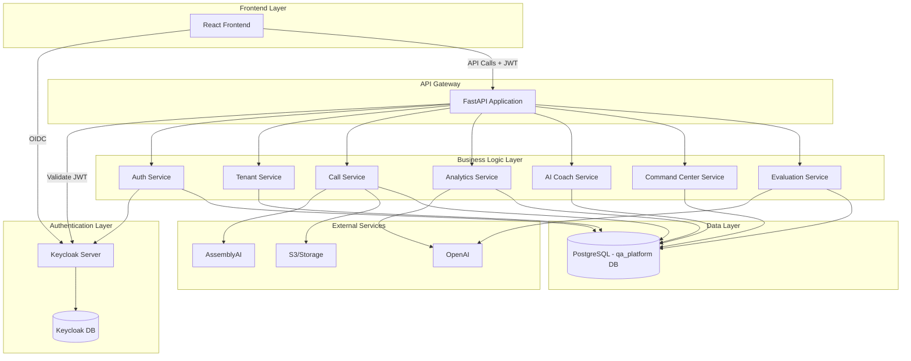

# FastAPI Multi-Tenant Migration Plan

## Executive Summary
This document outlines the complete migration plan for transforming the current FastAPI application from a simple Supabase-based system to a comprehensive multi-tenant platform with Keycloak authentication and advanced features including AI Coach and Command Center.

## Architecture Overview



## Current State Analysis

### Existing Components
1. **Database**: 2 tables in Supabase (uploaded_files, contact_submissions)
2. **Authentication**: Basic Supabase auth with JWT validation
3. **Core Features**:
   - Audio file upload and transcription
   - QA evaluation with OpenAI
   - Basic analytics
   - Contact form submissions

### Pain Points
- No multi-tenancy support
- Limited evaluation criteria (hardcoded)
- No role-based access control
- No real-time monitoring
- No training/coaching features

## Target Architecture

### Core Components

#### 1. Multi-Tenant Foundation
- **Tenant Isolation**: Row Level Security (RLS) with tenant_id
- **Tenant Types**: Default, Standard, Enterprise
- **Resource Limits**: Configurable per tenant tier

#### 2. Authentication & Authorization (Keycloak)
- **Realms**: One realm per tenant (qa-default, qa-acmecorp, etc.)
- **Roles**: super_admin, tenant_admin, manager, agent
- **Token Management**: JWT with tenant context
- **SSO Support**: SAML/OIDC for enterprise tenants

#### 3. Database Architecture
- **Primary DB**: qa_platform (PostgreSQL)
- **Keycloak DB**: keycloak (PostgreSQL)
- **Tenant Context**: Set via set_tenant_context() function
- **RLS Policies**: Automatic tenant isolation

## API Endpoints Design

### Authentication Endpoints

```yaml
Authentication:
  /api/auth/login:
    POST:
      description: Login with username/password
      body: { username, password, tenant_id }
      returns: { access_token, refresh_token, user_info }
  
  /api/auth/logout:
    POST:
      description: Logout and revoke tokens
      auth: required
  
  /api/auth/refresh:
    POST:
      description: Refresh access token
      body: { refresh_token }
      returns: { access_token, refresh_token }
  
  /api/auth/profile:
    GET:
      description: Get current user profile
      auth: required
      returns: { user_profile, permissions, tenant_info }
  
  /api/auth/change-password:
    POST:
      description: Change user password
      auth: required
      body: { current_password, new_password }
```

### Tenant Management Endpoints

```yaml
Tenants:
  /api/tenants:
    GET:
      description: List all tenants (super_admin only)
      auth: super_admin
      returns: [ { tenant_id, display_name, status, tier } ]
    
    POST:
      description: Create new tenant
      auth: super_admin
      body: { tenant_id, display_name, subdomain, tier }
  
  /api/tenants/{tenant_id}:
    GET:
      description: Get tenant details
      auth: tenant_admin
    
    PUT:
      description: Update tenant settings
      auth: tenant_admin
      body: { settings, branding, features }
  
  /api/tenants/{tenant_id}/usage:
    GET:
      description: Get tenant usage statistics
      auth: tenant_admin
      returns: { users, calls, storage_gb, limits }
```

### Organization & User Management

```yaml
Organizations:
  /api/organizations:
    GET:
      description: List organizations in tenant
      auth: required
      returns: [ { id, name, industry, users_count } ]
    
    POST:
      description: Create organization
      auth: tenant_admin
      body: { name, industry, size, timezone }
  
  /api/organizations/{org_id}/departments:
    GET:
      description: List departments
      auth: required
    
    POST:
      description: Create department
      auth: manager
      body: { name, description }
  
  /api/organizations/{org_id}/teams:
    GET:
      description: List teams
      auth: required
    
    POST:
      description: Create team
      auth: manager
      body: { name, department_id, team_lead_id }

Users:
  /api/users:
    GET:
      description: List users in organization
      auth: manager
      query: { role?, team_id?, department_id?, status? }
    
    POST:
      description: Create user
      auth: manager
      body: { email, first_name, last_name, role, team_id }
  
  /api/users/{user_id}:
    GET:
      description: Get user details
      auth: required
    
    PUT:
      description: Update user
      auth: manager
      body: { team_id?, department_id?, status? }
  
  /api/users/{user_id}/permissions:
    GET:
      description: Get user permissions
      auth: required
      returns: { roles, permissions, feature_flags }
```

### Call Management & Analysis

```yaml
Calls:
  /api/calls:
    GET:
      description: List calls with filters
      auth: required
      query: { 
        agent_id?, 
        date_from?, 
        date_to?, 
        status?, 
        min_score?,
        max_score?,
        page?,
        limit? 
      }
    
    POST:
      description: Upload call for analysis
      auth: agent
      body: multipart/form-data { audio_file, metadata }
      returns: { call_id, status, estimated_completion }
  
  /api/calls/{call_id}:
    GET:
      description: Get call details with analysis
      auth: required
      returns: {
        call_info,
        transcription,
        qa_evaluation,
        sentiment_analysis,
        customer_behavior,
        compliance_status
      }
    
    DELETE:
      description: Delete call and related data
      auth: manager
  
  /api/calls/{call_id}/transcription:
    GET:
      description: Get transcription status/result
      auth: required
    
    PUT:
      description: Update speaker labels
      auth: manager
      body: { segments: [{ index, speaker }] }
  
  /api/calls/{call_id}/analysis:
    GET:
      description: Get QA analysis
      auth: required
    
    POST:
      description: Trigger re-analysis
      auth: manager
      body: { criteria_set_id? }
  
  /api/calls/{call_id}/insights:
    GET:
      description: Get AI insights
      auth: required
      returns: [ { type, category, title, severity, suggestions } ]
```

### Evaluation Criteria Management

```yaml
EvaluationCriteria:
  /api/evaluation-criteria/templates:
    GET:
      description: List system default criteria
      auth: required
      returns: [ { id, name, category, default_points } ]
  
  /api/evaluation-criteria:
    GET:
      description: List organization criteria
      auth: required
      query: { active_only? }
      returns: [ { 
        id, 
        name, 
        description, 
        category, 
        max_points, 
        is_custom 
      } ]
    
    POST:
      description: Create custom criterion
      auth: manager
      body: { 
        name, 
        description, 
        category, 
        max_points,
        evaluation_prompts 
      }
  
  /api/evaluation-criteria/{criterion_id}:
    GET:
      description: Get criterion details
      auth: required
    
    PUT:
      description: Update criterion
      auth: manager
      body: { 
        description?, 
        max_points?, 
        evaluation_prompts?,
        is_active? 
      }
    
    DELETE:
      description: Delete custom criterion
      auth: manager
  
  /api/evaluation-criteria/sets:
    GET:
      description: List evaluation sets
      auth: required
      returns: [ { id, name, criteria_count, is_default } ]
    
    POST:
      description: Create evaluation set
      auth: manager
      body: { 
        name, 
        criteria_ids: [], 
        is_default? 
      }
```

### AI Coach Endpoints

```yaml
AICoach:
  /api/ai-coach/courses:
    GET:
      description: List available courses
      auth: agent
      query: { 
        category?, 
        difficulty?, 
        assigned_only? 
      }
    
    POST:
      description: Create training course
      auth: manager
      body: { 
        title, 
        description, 
        content, 
        skills_covered,
        estimated_hours 
      }
  
  /api/ai-coach/courses/{course_id}:
    GET:
      description: Get course details
      auth: agent
    
    PUT:
      description: Update course
      auth: manager
  
  /api/ai-coach/assignments:
    GET:
      description: Get my assignments
      auth: agent
      query: { status?, due_date? }
    
    POST:
      description: Assign course to agents
      auth: manager
      body: { 
        course_id, 
        agent_ids: [], 
        due_date?,
        priority? 
      }
  
  /api/ai-coach/assignments/{assignment_id}/progress:
    GET:
      description: Get assignment progress
      auth: agent
    
    POST:
      description: Update progress
      auth: agent
      body: { 
        module_id, 
        lesson_id?, 
        progress_type,
        score? 
      }
  
  /api/ai-coach/generate-course:
    POST:
      description: AI-generate course from call analysis
      auth: manager
      body: { 
        agent_id, 
        weakness_areas: [], 
        call_ids?: [] 
      }
      returns: { 
        course_id, 
        recommended_modules 
      }
  
  /api/ai-coach/recommendations/{agent_id}:
    GET:
      description: Get AI recommendations
      auth: manager
      returns: { 
        skill_gaps, 
        recommended_courses,
        improvement_areas 
      }
```

### Command Center Endpoints

```yaml
CommandCenter:
  /api/command-center/realtime:
    GET:
      description: Get real-time monitoring data
      auth: manager
      query: { team_id?, department_id? }
      returns: {
        active_calls: [],
        agent_statuses: {},
        alerts: [],
        metrics: {}
      }
  
  /api/command-center/alerts:
    GET:
      description: List active alerts
      auth: manager
      query: { 
        severity?, 
        type?, 
        status? 
      }
    
    POST:
      description: Create manual alert
      auth: manager
      body: { 
        type, 
        severity, 
        entity_type,
        entity_id, 
        title, 
        description 
      }
  
  /api/command-center/alerts/{alert_id}:
    PUT:
      description: Update alert status
      auth: manager
      body: { 
        status, 
        resolution_notes? 
      }
  
  /api/command-center/dashboard:
    GET:
      description: Get dashboard configuration
      auth: required
    
    PUT:
      description: Update dashboard layout
      auth: required
      body: { 
        widgets: [{ 
          type, 
          position, 
          config 
        }] 
      }
  
  /api/command-center/metrics:
    GET:
      description: Get aggregated metrics
      auth: manager
      query: { 
        period, 
        group_by? 
      }
      returns: {
        call_volume,
        average_scores,
        compliance_rate,
        agent_performance
      }
```

### Analytics & Reporting

```yaml
Analytics:
  /api/analytics/summary:
    GET:
      description: Get analytics summary
      auth: required
      query: { 
        from_date, 
        to_date, 
        agent_id?, 
        team_id? 
      }
  
  /api/analytics/trends:
    GET:
      description: Get trend analysis
      auth: manager
      query: { 
        metric, 
        period, 
        group_by 
      }
  
  /api/analytics/agent-performance:
    GET:
      description: Get agent performance metrics
      auth: manager
      query: { 
        agent_id?, 
        period 
      }
  
  /api/reports:
    GET:
      description: List available reports
      auth: required
    
    POST:
      description: Generate report
      auth: manager
      body: { 
        type, 
        filters, 
        format 
      }
      returns: { 
        report_id, 
        status 
      }
  
  /api/reports/{report_id}/download:
    GET:
      description: Download generated report
      auth: required
      returns: file (pdf/excel/csv)
  
  /api/reports/scheduled:
    GET:
      description: List scheduled reports
      auth: manager
    
    POST:
      description: Schedule recurring report
      auth: manager
      body: { 
        name, 
        type, 
        schedule, 
        recipients 
      }
```

### System Administration

```yaml
Admin:
  /api/admin/feature-flags:
    GET:
      description: List feature flags
      auth: tenant_admin
    
    PUT:
      description: Update feature flag
      auth: tenant_admin
      body: { 
        feature_key, 
        enabled, 
        rollout_percentage 
      }
  
  /api/admin/settings:
    GET:
      description: Get tenant settings
      auth: tenant_admin
      query: { category? }
    
    PUT:
      description: Update settings
      auth: tenant_admin
      body: { 
        category, 
        settings: {} 
      }
  
  /api/admin/audit-logs:
    GET:
      description: Get audit logs
      auth: tenant_admin
      query: { 
        from_date?, 
        to_date?, 
        user_id?, 
        action? 
      }
  
  /api/admin/compliance-templates:
    GET:
      description: List compliance templates
      auth: manager
    
    POST:
      description: Create compliance template
      auth: tenant_admin
      body: { 
        name, 
        regulation_type,
        requirements 
      }
```

## Migration Strategy

### Phase 1: Foundation (Week 1-2)
1. **Database Migration**
   - Set up PostgreSQL with multi-tenant schema
   - Migrate existing data to new structure
   - Implement RLS policies

2. **Keycloak Integration**
   - Deploy Keycloak with qa-default realm
   - Configure clients and roles
   - Implement JWT validation

3. **Core Services**
   - Create base service classes
   - Implement tenant context management
   - Add authentication middleware

### Phase 2: Core Features Migration (Week 3-4)
1. **Call Management**
   - Migrate upload functionality
   - Update transcription flow
   - Implement new analysis structure

2. **Evaluation Criteria**
   - Create CRUD endpoints
   - Implement customizable criteria
   - Update OpenAI integration

3. **User Management**
   - Implement user profile sync
   - Add role-based permissions
   - Create organization structure

### Phase 3: Advanced Features (Week 5-6)
1. **AI Coach**
   - Implement course management
   - Create assignment system
   - Add progress tracking

2. **Command Center**
   - Real-time monitoring
   - Alert system
   - Dashboard configuration

3. **Analytics & Reporting**
   - Aggregate metrics
   - Scheduled reports
   - Performance tracking

### Phase 4: Testing & Deployment (Week 7-8)
1. **Testing**
   - Unit tests for all services
   - Integration testing
   - Performance testing

2. **Documentation**
   - API documentation
   - User guides
   - Admin documentation

3. **Deployment**
   - Production setup
   - Data migration
   - Monitoring setup

## Key Implementation Considerations

### 1. Tenant Isolation
```python
# Every request must set tenant context
async def set_request_context(request: Request, token_data: dict):
    tenant_id = token_data.get("tenant_id", "default")
    user_id = token_data.get("sub")
    
    # Set PostgreSQL session variables
    await db.execute(
        "SELECT set_tenant_context(:tenant_id, :user_id)",
        {"tenant_id": tenant_id, "user_id": user_id}
    )
```

### 2. Evaluation Criteria Usage
```python
# Before sending to OpenAI
async def prepare_evaluation_prompt(call_id: str, tenant_id: str):
    # Get organization's active criteria
    criteria = await get_active_criteria(tenant_id)
    
    # Build evaluation prompt with custom criteria
    prompt = build_evaluation_prompt(
        transcript=transcript,
        criteria=criteria,
        max_points_per_criterion=20
    )
    
    return prompt
```

### 3. Feature Flag Checking
```python
# Check feature availability
async def check_feature(tenant_id: str, feature: str, user: dict):
    enabled = await db.fetch_val(
        "SELECT is_feature_enabled(:tenant, :feature, :user_id, :role)",
        {
            "tenant": tenant_id,
            "feature": feature,
            "user_id": user.get("id"),
            "role": user.get("role")
        }
    )
    return enabled
```

## Security Considerations

1. **JWT Validation**: All requests must have valid Keycloak JWT
2. **Tenant Isolation**: RLS ensures data isolation
3. **Role-Based Access**: Permissions checked at service level
4. **Audit Logging**: All critical actions logged
5. **Data Encryption**: Sensitive data encrypted at rest

## Performance Optimizations

1. **Database Indexes**: Proper indexes on tenant_id, timestamps
2. **Caching**: Redis for frequently accessed data
3. **Async Processing**: Background jobs for heavy operations
4. **Connection Pooling**: Efficient database connections
5. **API Rate Limiting**: Prevent abuse

## Monitoring & Observability

1. **Application Metrics**: Prometheus + Grafana
2. **Log Aggregation**: ELK Stack
3. **Error Tracking**: Sentry
4. **Uptime Monitoring**: Better Uptime
5. **Database Monitoring**: pgAdmin

## Rollback Strategy

1. **Database Backups**: Daily automated backups
2. **Feature Flags**: Gradual rollout capability
3. **API Versioning**: Support legacy endpoints
4. **Data Export**: Tools for data extraction

## Success Criteria

1. **Zero Downtime Migration**: No service interruption
2. **Data Integrity**: 100% data migrated correctly
3. **Performance**: <100ms API response time
4. **Security**: Pass security audit
5. **User Adoption**: 90% feature utilization

## Next Steps

1. Review and approve migration plan
2. Set up development environment
3. Begin Phase 1 implementation
4. Weekly progress reviews
5. Continuous testing and validation
