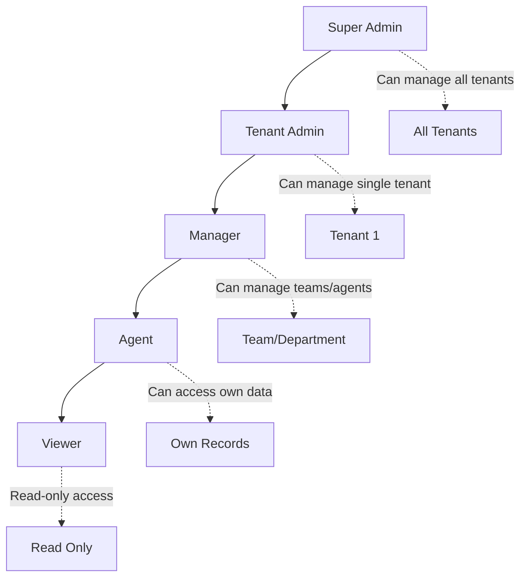

# Role-Based Access Control (RBAC) Documentation

## Overview

The QA Platform implements a comprehensive Role-Based Access Control (RBAC) system that provides fine-grained permissions management across multiple tenants. The system supports hierarchical role structures with resource-level permissions.

## Role Hierarchy



## Role Definitions

### 1. Super Admin
**Scope**: Cross-tenant administrative access
**Purpose**: Platform-wide management and oversight

**Capabilities**:
- Manage all tenants and their configurations
- Create and configure new tenant instances
- Access system-wide analytics and reports
- Manage pricing plans and billing
- Override tenant-specific restrictions
- System maintenance and monitoring

**Limitations**:
- Cannot directly manage day-to-day operations within tenants
- Requires tenant context switching for tenant-specific actions

### 2. Tenant Admin
**Scope**: Single tenant administrative access
**Purpose**: Complete management within their tenant

**User Creation Limits**:
- Can create managers: ✅ (up to `max_managers_allowed`)
- Can create agents: ✅ (up to `max_agents_allowed`)
- Default limits: 10 managers, 50 agents

**Resource Permissions**:

| Resource | Create | Read | Update | Delete | Notes |
|----------|--------|------|--------|--------|-------|
| Organization | ✅ | ✅ | ✅ | ✅ | Own tenant only |
| Users | ✅ | ✅ | ✅ | ✅ | Within tenant |
| Departments | ✅ | ✅ | ✅ | ✅ | All departments |
| Teams | ✅ | ✅ | ✅ | ✅ | All teams |
| Agents | ✅ | ✅ | ✅ | ✅ | All agents |
| Calls | ✅ | ✅ | ✅ | ✅ | All calls |
| Analytics | ✅ | ✅ | - | - | Full analytics access |
| Reports | ✅ | ✅ | - | - | All reports |
| Evaluations | ✅ | ✅ | ✅ | ✅ | All evaluations |
| Settings | - | ✅ | ✅ | - | Tenant settings |

**Special Capabilities**:
- Configure evaluation criteria
- Set up compliance templates
- Manage feature flags
- Configure integrations (SMTP, APIs)
- Billing and subscription management

### 3. Manager
**Scope**: Department/Team level management
**Purpose**: Operational management of teams and agents

**User Creation Limits**:
- Can create managers: ❌
- Can create agents: ✅ (up to `max_agents_allowed`)
- Default limits: 0 managers, 20 agents

**Resource Permissions**:

| Resource | Create | Read | Update | Delete | Notes |
|----------|--------|------|--------|--------|-------|
| Organization | ❌ | ✅ | ❌ | ❌ | Read-only access |
| Users | ❌ | ✅ | ❌ | ❌ | View team members |
| Agents | ✅ | ✅ | ✅ | ❌ | Create/manage agents |
| Departments | ❌ | ✅ | ❌ | ❌ | View own department |
| Teams | ❌ | ✅ | ✅ | ❌ | Manage assigned teams |
| Calls | ✅ | ✅ | ✅ | ✅ | Team calls only |
| Analytics | ❌ | ✅ | ❌ | ❌ | Team-level analytics |
| Reports | ✅ | ✅ | ❌ | ❌ | Generate team reports |
| Evaluations | ✅ | ✅ | ✅ | ✅ | Team evaluations |

**Data Scope Restrictions**:
- Can only see data for their assigned teams/departments
- Cannot access other managers' teams
- Limited to team-level analytics and reports

### 4. Agent
**Scope**: Individual agent access
**Purpose**: Day-to-day call handling and personal performance tracking

**User Creation Limits**:
- Can create managers: ❌
- Can create agents: ❌
- Cannot create any users

**Resource Permissions**:

| Resource | Create | Read | Update | Delete | Notes |
|----------|--------|------|--------|--------|-------|
| Organization | ❌ | ✅ | ❌ | ❌ | Basic org info |
| Users | ❌ | ✅* | ❌ | ❌ | Own profile only |
| Departments | ❌ | ✅ | ❌ | ❌ | Own department |
| Teams | ❌ | ✅ | ❌ | ❌ | Own team |
| Calls | ❌ | ✅* | ❌ | ❌ | Own calls only |
| Analytics | ❌ | ✅* | ❌ | ❌ | Personal analytics |
| Evaluations | ❌ | ✅* | ❌ | ❌ | Own evaluations |

*\* Restricted to own data only*

**Special Restrictions**:
- Cannot see other agents' performance data
- Cannot access team-wide analytics
- Cannot modify evaluation criteria
- Read-only access to most resources

### 5. Viewer
**Scope**: Read-only access
**Purpose**: Stakeholders who need visibility without operational access

**Resource Permissions**:
- Read-only access to assigned resources
- Cannot create, update, or delete any data
- Typically used for executives, auditors, or external stakeholders

## Permission Matrix

### Complete Permission Matrix

| Resource/Action | Super Admin | Tenant Admin | Manager | Agent | Viewer |
|----------------|-------------|--------------|---------|-------|--------|
| **Tenant Management** |
| Create Tenant | ✅ | ❌ | ❌ | ❌ | ❌ |
| Read Tenant | ✅ | ✅* | ❌ | ❌ | ❌ |
| Update Tenant | ✅ | ✅* | ❌ | ❌ | ❌ |
| Delete Tenant | ✅ | ❌ | ❌ | ❌ | ❌ |
| **User Management** |
| Create Tenant Admin | ✅ | ❌ | ❌ | ❌ | ❌ |
| Create Manager | ✅ | ✅ | ❌ | ❌ | ❌ |
| Create Agent | ✅ | ✅ | ✅ | ❌ | ❌ |
| Read Users | ✅ | ✅ | ✅** | ✅*** | ✅** |
| Update Users | ✅ | ✅ | ✅** | ✅*** | ❌ |
| Delete Users | ✅ | ✅ | ❌ | ❌ | ❌ |
| **Call Management** |
| Create Call | ✅ | ✅ | ✅ | ❌ | ❌ |
| Read Calls | ✅ | ✅ | ✅** | ✅*** | ✅** |
| Update Calls | ✅ | ✅ | ✅** | ❌ | ❌ |
| Delete Calls | ✅ | ✅ | ✅** | ❌ | ❌ |
| **Analytics & Reports** |
| System Analytics | ✅ | ❌ | ❌ | ❌ | ❌ |
| Tenant Analytics | ✅ | ✅ | ❌ | ❌ | ❌ |
| Team Analytics | ✅ | ✅ | ✅** | ❌ | ✅** |
| Personal Analytics | ✅ | ✅ | ✅ | ✅*** | ✅*** |
| **Evaluation Management** |
| Create Criteria | ✅ | ✅ | ❌ | ❌ | ❌ |
| Create Evaluations | ✅ | ✅ | ✅** | ❌ | ❌ |
| Read Evaluations | ✅ | ✅ | ✅** | ✅*** | ✅** |
| Update Evaluations | ✅ | ✅ | ✅** | ❌ | ❌ |

**Legend:**
- ✅ = Full access
- ❌ = No access
- ✅* = Own tenant only
- ✅** = Team/department scope only
- ✅*** = Own data only

## Data Isolation and Security

### Row-Level Security (RLS)
The system implements PostgreSQL Row-Level Security to ensure data isolation:

```sql
-- Example RLS policy for tenant isolation
CREATE POLICY tenant_isolation_calls ON calls
FOR ALL
USING (tenant_id = current_tenant_id());

-- Example RLS policy for team-level access
CREATE POLICY manager_team_access ON calls
FOR ALL
USING (
    EXISTS (
        SELECT 1 FROM agents a
        JOIN user_profiles up ON a.user_profile_id = up.id
        WHERE a.id = calls.agent_id
        AND up.team_id IN (
            SELECT team_id FROM user_profiles
            WHERE id = current_user_id()
            AND role = 'manager'
        )
    )
);
```

### Permission Enforcement
Permissions are enforced at multiple levels:

1. **Database Level**: RLS policies prevent unauthorized data access
2. **API Level**: Middleware checks permissions before processing requests
3. **UI Level**: Interface elements are hidden/disabled based on permissions
4. **Keycloak Level**: Role-based authentication and authorization

## Implementation Details

### Database Schema
Key RBAC tables:

```sql
-- Role permissions definition
CREATE TABLE role_permissions (
    id UUID PRIMARY KEY,
    role VARCHAR(50) NOT NULL,
    resource VARCHAR(100) NOT NULL,
    action VARCHAR(50) NOT NULL,
    conditions JSONB DEFAULT '{}'
);

-- User role assignments with hierarchy
CREATE TABLE user_profiles (
    id UUID PRIMARY KEY,
    role VARCHAR(50) NOT NULL,
    created_by_user_id UUID,
    can_create_managers BOOLEAN DEFAULT FALSE,
    can_create_agents BOOLEAN DEFAULT FALSE,
    max_agents_allowed INTEGER DEFAULT 0,
    max_managers_allowed INTEGER DEFAULT 0
);
```

### API Middleware
Permission checking middleware:

```python
@require_permission('call', 'read')
async def get_calls(current_user: dict, db: Session):
    # Permission already verified by decorator
    # RLS will filter results based on user's scope
    return db.query(Call).all()

@require_role(['tenant_admin', 'manager'])
async def create_agent(agent_data: dict, current_user: dict):
    # Check creation limits
    if not can_create_user(current_user, 'agent'):
        raise HTTPException(403, "Agent creation limit exceeded")
    # Proceed with creation
```

### Frontend Permission Checks
React component example:

```javascript
import { usePermissions } from './hooks/usePermissions';

function CallManagement() {
    const { hasPermission, userRole } = usePermissions();
    
    return (
        <div>
            {hasPermission('call', 'read') && <CallList />}
            {hasPermission('call', 'create') && <CreateCallButton />}
            {userRole === 'tenant_admin' && <AdminSettings />}
        </div>
    );
}
```

## Best Practices

### 1. Principle of Least Privilege
- Users are granted only the minimum permissions necessary
- Regular permission audits should be conducted
- Temporary elevated access should be time-limited

### 2. Role Assignment Guidelines
- New users start with the lowest appropriate role
- Role escalation requires approval from higher-level users
- Document all role changes with justification

### 3. Data Scope Management
- Managers should only access their team's data
- Cross-team access requires explicit approval
- Audit logs track all data access patterns

### 4. Security Monitoring
- Monitor for privilege escalation attempts
- Track unusual access patterns
- Regular security reviews of role assignments

## Troubleshooting

### Common Permission Issues

1. **User Cannot See Expected Data**
   - Check RLS policies are correctly applied
   - Verify user's team/department assignments
   - Confirm tenant context is set correctly

2. **Permission Denied Errors**
   - Verify role assignments in Keycloak
   - Check database role_permissions table
   - Ensure API middleware is correctly configured

3. **Cross-Tenant Data Leakage**
   - Audit RLS policies
   - Check tenant_id filtering in queries
   - Verify session tenant context

### Debugging Commands

```sql
-- Check user's effective permissions
SELECT rp.* FROM role_permissions rp
JOIN user_profiles up ON rp.role = up.role
WHERE up.keycloak_user_id = 'user-id';

-- Verify RLS policies
SELECT schemaname, tablename, policyname, permissive, roles, cmd, qual
FROM pg_policies
WHERE schemaname = 'public';

-- Check tenant context
SELECT current_setting('app.current_tenant', true) as current_tenant,
       current_setting('app.current_user', true) as current_user;
```

This RBAC system provides comprehensive security while maintaining usability and scalability across multiple tenants.
