# Role-Based Authentication & Authorization Flow

This diagram shows the complete flow of the role-based authentication system including signup, login, and request processing with RBAC middleware.

```mermaid
graph TB
    %% Actors
    Client[Client Application]
    TenantAdmin[Tenant Administrator]
    Manager[Manager]
    Agent[Agent]
    
    %% External Systems
    Keycloak[Keycloak Identity Provider]
    SMTP[SMTP Server - Zoho Mail]
    
    %% API Layer
    subgraph "FastAPI Application"
        %% Middleware Pipeline
        subgraph "Middleware Pipeline (Order: Audit → RBAC → Tenant → Auth)"
            AuditMW[Audit Middleware<br/>Log requests/responses]
            RBACMW[RBAC Middleware<br/>Check permissions]
            TenantMW[Tenant Context Middleware<br/>Set tenant context]
            AuthMW[Auth Middleware<br/>JWT validation]
        end
        
        %% API Endpoints
        subgraph "API Endpoints"
            RoleAuthAPI[Role Auth API<br/>/api/role-auth/*]
            OrgMgmtAPI[Organization Management API<br/>/api/org-management/*]
            DeprecatedAPI[Deprecated Auth API<br/>/api/auth/* → 410 Gone]
        end
        
        %% Services
        subgraph "Services Layer"
            RoleAuthService[Role Auth Service<br/>User creation & authentication]
            AuthService[Auth Service<br/>Keycloak integration]
        end
        
        %% Repositories
        subgraph "Repository Layer"
            UserRepo[User Repository<br/>UserProfile CRUD]
            AgentRepo[Agent Repository<br/>Agent CRUD]
            OrgRepo[Organization Repository<br/>Organization CRUD]
        end
        
        %% Security & RBAC
        subgraph "Security & RBAC"
            SecurityCore["Security Core<br/>get_current_user"]
            RBACCore["RBAC Manager<br/>Permission checking"]
            PermissionDB[("Role Permissions<br/>Database")]
        end
    end
    
    %% Database
    subgraph "Database"
        UserProfileTable[(user_profiles)]
        AgentTable[(agents)]
        OrganizationTable[(organizations)]
        PricingTable[(pricing_plans)]
        RolePermTable[(role_permissions)]
    end

    %% SIGNUP FLOWS
    
    %% Tenant Admin Signup Flow
    Client -->|1. POST /role-auth/tenant-admin/signup<br/>org_name, admin_email, password| RoleAuthAPI
    RoleAuthAPI -->|2. create_tenant_admin| RoleAuthService
    RoleAuthService -->|3. Check org name uniqueness| OrgRepo
    RoleAuthService -->|4. Check email uniqueness| UserRepo
    RoleAuthService -->|5. Create Keycloak user<br/>enabled=true, emailVerified=false| AuthService
    AuthService -->|6. POST /admin/realms/qa-default/users| Keycloak
    Keycloak -->|7. Send verification email| SMTP
    RoleAuthService -->|8. Create Organization| OrganizationTable
    RoleAuthService -->|9. Create UserProfile<br/>role=tenant_admin| UserProfileTable
    RoleAuthService -->|10. Response: verification_required=true| Client
    
    %% Manager Signup Flow (by Tenant Admin)
    TenantAdmin -->|1. POST /role-auth/manager/signup<br/>Bearer: admin_token| RoleAuthAPI
    RoleAuthAPI -->|2. Verify role=tenant_admin| SecurityCore
    RoleAuthAPI -->|3. create_manager| RoleAuthService
    RoleAuthService -->|4. Validate same organization| OrgRepo
    RoleAuthService -->|5. Create Keycloak user<br/>temp password if needed| AuthService
    AuthService -->|6. Create user + send email| Keycloak
    RoleAuthService -->|7. Create UserProfile<br/>role=manager| UserProfileTable
    RoleAuthService -->|8. Increment manager count| OrganizationTable
    
    %% Agent Signup Flow (by Tenant Admin or Manager)
    Manager -->|1. POST /role-auth/agent/signup<br/>Bearer: manager_token| RoleAuthAPI
    RoleAuthAPI -->|2. Verify role in tenant_admin or manager| SecurityCore
    RoleAuthAPI -->|3. create_agent| RoleAuthService
    RoleAuthService -->|4. Create Keycloak user| AuthService
    RoleAuthService -->|5. Create UserProfile<br/>role=agent| UserProfileTable
    RoleAuthService -->|6. Generate agent_code| AgentRepo
    RoleAuthService -->|7. Create Agent record| AgentTable
    RoleAuthService -->|8. Increment agent count| OrganizationTable
    
    %% LOGIN FLOW
    
    %% Role-Based Login
    Agent -->|1. POST /role-auth/login<br/>email, password, role=agent| RoleAuthAPI
    RoleAuthAPI -->|2. authenticate_user| RoleAuthService
    RoleAuthService -->|3. Get user by email| UserRepo
    RoleAuthService -->|4. Verify role matches| RoleAuthService
    RoleAuthService -->|5. Authenticate with Keycloak| AuthService
    AuthService -->|6. POST /realms/qa-default/protocol/openid-connect/token| Keycloak
    Keycloak -->|7. Return JWT tokens<br/>if email verified| AuthService
    RoleAuthService -->|8. Get role permissions| RBACCore
    RoleAuthService -->|9. Return tokens + user info + permissions| Agent
    
    %% REQUEST PROCESSING WITH RBAC
    
    %% Authenticated Request Flow
    Agent -->|1. GET /api/calls<br/>Bearer: agent_token| AuditMW
    AuditMW -->|2. Log request| RBACMW
    RBACMW -->|3. Check permission: call:read| RBACCore
    RBACCore -->|4. Get user permissions| PermissionDB
    RBACCore -->|5. Verify agent has call:read| RBACMW
    RBACMW -->|6. Permission granted| TenantMW
    TenantMW -->|7. Set tenant context| AuthMW
    AuthMW -->|8. Validate JWT & get user| SecurityCore
    SecurityCore -->|9. Verify token with Keycloak public key| SecurityCore
    SecurityCore -->|10. Load UserProfile| UserRepo
    SecurityCore -->|11. Inject current_user + permissions| OrgMgmtAPI
    OrgMgmtAPI -->|12. Process request with user context| Agent
    
    %% RBAC PERMISSION MATRIX
    
    %% Permission Definitions
    subgraph "RBAC Permission Matrix"
        TenantAdminPerms[Tenant Admin<br/>• organization:* <br/>• user:* <br/>• call:* <br/>• evaluation:* <br/>• analytics:* <br/>• settings:*]
        ManagerPerms[Manager<br/>• organization:read <br/>• agent:create <br/>• user:read <br/>• call:* <br/>• evaluation:* <br/>• analytics:read]
        AgentPerms[Agent<br/>• organization:read <br/>• user:read_own <br/>• call:read <br/>• analytics:read]
    end
    
    %% DEPRECATED FLOW
    Client -.->|POST /api/auth/signup<br/>POST /api/auth/login| DeprecatedAPI
    DeprecatedAPI -.->|HTTP 410 Gone<br/>Use /api/role-auth/*| Client
    
    %% Data Flow Connections
    RBACCore --> RolePermTable
    SecurityCore --> UserProfileTable
    UserRepo --> UserProfileTable
    AgentRepo --> AgentTable
    OrgRepo --> OrganizationTable
    
    %% Styling
    classDef actor fill:#e1f5fe
    classDef api fill:#f3e5f5
    classDef service fill:#e8f5e8
    classDef database fill:#fff3e0
    classDef security fill:#ffebee
    classDef deprecated fill:#fafafa,stroke:#999,stroke-dasharray: 5 5
    
    class Client,TenantAdmin,Manager,Agent actor
    class RoleAuthAPI,OrgMgmtAPI api
    class RoleAuthService,AuthService service
    class UserProfileTable,AgentTable,OrganizationTable,PricingTable,RolePermTable database
    class SecurityCore,RBACCore,PermissionDB security
    class DeprecatedAPI deprecated
```

## Key Flow Explanations:

### 1. **Tenant Admin Signup** (Organization Creation)
- Creates both organization and first admin user
- Requires email verification before login
- Sets up role hierarchy permissions

### 2. **Manager/Agent Creation** (By Authorized Users)
- Tenant Admin can create Managers and Agents
- Manager can only create Agents
- Automatic Agent table record creation for agents
- Email verification + temporary passwords

### 3. **Role-Based Login**
- Verifies role matches user's actual role in database
- Returns JWT tokens with embedded permissions
- Keycloak handles email verification enforcement

### 4. **Request Processing Pipeline**
- **Audit**: Logs all requests/responses
- **RBAC**: Checks path-based permissions against user role
- **Tenant**: Sets database tenant context
- **Auth**: Validates JWT and loads user profile

### 5. **Permission System**
- Default permissions defined per role in code
- Database-stored permissions for customization
- Hierarchical: Tenant Admin > Manager > Agent
- Resource-action based (e.g., `call:read`, `user:create`)

### 6. **Database Integration**
- UserProfile stores role and hierarchy info
- Agent table linked to UserProfile for agents
- Organization tracks user counts automatically
- Pricing plans and permissions stored for future billing

This system ensures proper role separation, email verification, and granular permission control while maintaining a clean API structure.
