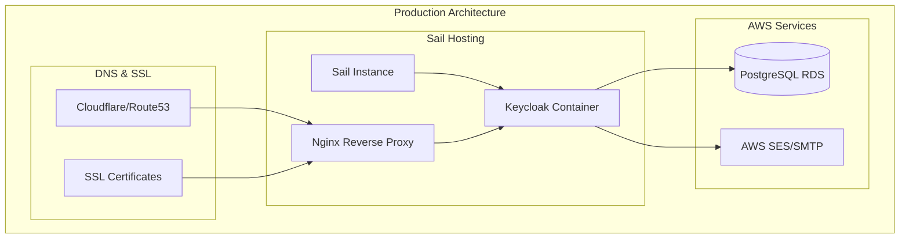

# Keycloak Migration to Sail Hosting - Complete Guide

## Overview

This guide provides step-by-step instructions to migrate your Keycloak setup from local Docker to a live Sail hosting instance while maintaining the same database and multi-tenant architecture.

## Prerequisites

- Existing PostgreSQL database (RDS or similar)
- Domain name configured (e.g., oryxintelligence.com)
- SMTP service credentials
- Sail hosting account

## Architecture Overview



## Step 1: Sail Instance Setup

### 1.1 Create Sail Instance

```bash
# Create a new Sail instance
# Choose appropriate size based on your needs:
# - Small: 1 vCPU, 1GB RAM (for testing)
# - Medium: 2 vCPU, 4GB RAM (recommended for production)
# - Large: 4 vCPU, 8GB RAM (for high traffic)

# Instance specifications:
# - OS: Ubuntu 22.04 LTS
# - Size: Medium (2 vCPU, 4GB RAM)
# - Storage: 50GB SSD
```

### 1.2 Initial Server Setup

```bash
# Connect to your Sail instance
ssh root@your-sail-instance-ip

# Update system
apt update && apt upgrade -y

# Install required packages
apt install -y docker.io docker-compose-plugin nginx certbot python3-certbot-nginx ufw curl wget

# Start and enable Docker
systemctl start docker
systemctl enable docker

# Add user to docker group (if using non-root user)
usermod -aG docker $USER

# Configure firewall
ufw allow OpenSSH
ufw allow 'Nginx Full'
ufw allow 80
ufw allow 443
ufw --force enable
```

## Step 2: Domain and SSL Configuration

### 2.1 DNS Configuration

Configure your DNS records to point to your Sail instance:

```bash
# DNS Records to create:
# A record: auth.oryxintelligence.com -> YOUR_SAIL_IP
# CNAME: *.auth.oryxintelligence.com -> auth.oryxintelligence.com
```

### 2.2 SSL Certificate Setup

```bash
# Install SSL certificate using Certbot
certbot --nginx -d auth.oryxintelligence.com

# Verify certificate
certbot certificates

# Set up auto-renewal
crontab -e
# Add this line:
# 0 12 * * * /usr/bin/certbot renew --quiet
```

### 2.3 Nginx Configuration

Create `/etc/nginx/sites-available/keycloak`:

```nginx
server {
    listen 80;
    server_name auth.oryxintelligence.com;
    return 301 https://$server_name$request_uri;
}

server {
    listen 443 ssl http2;
    server_name auth.oryxintelligence.com;

    ssl_certificate /etc/letsencrypt/live/auth.oryxintelligence.com/fullchain.pem;
    ssl_certificate_key /etc/letsencrypt/live/auth.oryxintelligence.com/privkey.pem;
    
    # SSL Configuration
    ssl_protocols TLSv1.2 TLSv1.3;
    ssl_ciphers ECDHE-RSA-AES256-GCM-SHA512:DHE-RSA-AES256-GCM-SHA512:ECDHE-RSA-AES256-GCM-SHA384:DHE-RSA-AES256-GCM-SHA384;
    ssl_prefer_server_ciphers off;
    ssl_session_cache shared:SSL:10m;
    ssl_session_timeout 10m;
    
    # Security headers
    add_header X-Frame-Options DENY;
    add_header X-Content-Type-Options nosniff;
    add_header X-XSS-Protection "1; mode=block";
    add_header Strict-Transport-Security "max-age=31536000; includeSubDomains" always;
    
    # Keycloak proxy settings
    location / {
        proxy_pass http://localhost:8080;
        proxy_set_header Host $host;
        proxy_set_header X-Real-IP $remote_addr;
        proxy_set_header X-Forwarded-For $proxy_add_x_forwarded_for;
        proxy_set_header X-Forwarded-Proto $scheme;
        proxy_set_header X-Forwarded-Port $server_port;
        
        # WebSocket support
        proxy_http_version 1.1;
        proxy_set_header Upgrade $http_upgrade;
        proxy_set_header Connection "upgrade";
        
        # Timeouts
        proxy_connect_timeout 60s;
        proxy_send_timeout 60s;
        proxy_read_timeout 60s;
        
        # Buffer settings
        proxy_buffering on;
        proxy_buffer_size 128k;
        proxy_buffers 4 256k;
        proxy_busy_buffers_size 256k;
    }
    
    # Health check endpoint
    location /health {
        proxy_pass http://localhost:8080/health;
        access_log off;
    }
}
```

Enable the site:
```bash
ln -s /etc/nginx/sites-available/keycloak /etc/nginx/sites-enabled/
nginx -t
systemctl reload nginx
```

## Step 3: Keycloak Production Setup

### 3.1 Create Directory Structure

```bash
# Create Keycloak directory
mkdir -p /opt/keycloak/{data,themes,providers,realms,logs}
cd /opt/keycloak

# Set permissions
chown -R 1000:1000 /opt/keycloak
```

### 3.2 Environment Configuration

Create `/opt/keycloak/.env`:

```bash
# Database Configuration
DB_HOST=your-rds-endpoint.region.rds.amazonaws.com
DB_NAME=keycloak
DB_USER=keycloak_user
DB_PASSWORD=your_secure_password

# Keycloak Admin
KEYCLOAK_ADMIN=admin
KEYCLOAK_ADMIN_PASSWORD=your_admin_password

# SMTP Configuration
SMTP_HOST=email-smtp.us-east-1.amazonaws.com
SMTP_PORT=587
SMTP_USER=your_ses_smtp_user
SMTP_PASSWORD=your_ses_smtp_password
SMTP_FROM=noreply@oryxintelligence.com
SMTP_FROM_NAME=QA Platform

# Client Secrets
BACKEND_CLIENT_SECRET=your_backend_client_secret
FRONTEND_CLIENT_SECRET=your_frontend_client_secret

# Production Settings
KC_HOSTNAME=auth.oryxintelligence.com
KC_PROXY=edge
```

### 3.3 Production Docker Compose

Create `/opt/keycloak/docker-compose.yml`:

```yaml
version: '3.8'

services:
  keycloak:
    image: quay.io/keycloak/keycloak:22.0
    container_name: keycloak-production
    restart: unless-stopped
    command: start --optimized
    
    environment:
      # Database
      KC_DB: postgres
      KC_DB_URL: jdbc:postgresql://${DB_HOST}:5432/${DB_NAME}
      KC_DB_USERNAME: ${DB_USER}
      KC_DB_PASSWORD: ${DB_PASSWORD}
      
      # Admin
      KEYCLOAK_ADMIN: ${KEYCLOAK_ADMIN}
      KEYCLOAK_ADMIN_PASSWORD: ${KEYCLOAK_ADMIN_PASSWORD}
      
      # Hostname and Proxy
      KC_HOSTNAME: ${KC_HOSTNAME}
      KC_HOSTNAME_STRICT: true
      KC_HOSTNAME_STRICT_HTTPS: true
      KC_PROXY: ${KC_PROXY}
      KC_HTTP_ENABLED: true
      KC_HTTP_PORT: 8080
      
      # Features for multi-tenancy
      KC_FEATURES: token-exchange,admin-fine-grained-authz,scripts,preview,account-api,account2,admin2,authorization,ciba,client-policies,declarative-user-profile,docker,impersonation,openshift-integration,par,recovery-codes,scripts,step-up-authentication,token-exchange,web-authn
      
      # Performance and Security
      KC_DB_POOL_INITIAL_SIZE: 5
      KC_DB_POOL_MIN_SIZE: 5
      KC_DB_POOL_MAX_SIZE: 20
      KC_TRANSACTION_XA_ENABLED: false
      KC_CACHE: ispn
      KC_CACHE_STACK: kubernetes
      
      # Logging
      KC_LOG_LEVEL: INFO
      KC_LOG_CONSOLE_OUTPUT: default
      
      # Health and Metrics
      KC_HEALTH_ENABLED: true
      KC_METRICS_ENABLED: true
      
    ports:
      - "8080:8080"
      
    volumes:
      - ./data:/opt/keycloak/data
      - ./themes:/opt/keycloak/themes
      - ./providers:/opt/keycloak/providers
      - ./realms:/opt/keycloak/data/import
      - ./logs:/opt/keycloak/logs
      
    healthcheck:
      test: ["CMD", "curl", "-f", "http://localhost:8080/health/ready"]
      interval: 30s
      timeout: 10s
      retries: 3
      start_period: 120s
      
    deploy:
      resources:
        limits:
          memory: 2G
        reservations:
          memory: 1G
```

## Step 4: Database Migration

### 4.1 Export Current Realm Configuration

From your local setup:

```bash
# Export current realm
docker exec keycloak-local /opt/keycloak/bin/kc.sh export \
  --realm qa-default \
  --file /opt/keycloak/data/export/qa-default-production.json \
  --users realm_file

# Copy the exported file
docker cp keycloak-local:/opt/keycloak/data/export/qa-default-production.json ./realms/
```

### 4.2 Update Realm Configuration for Production

Edit `./realms/qa-default-production.json`:

```json
{
  "realm": "qa-default",
  "enabled": true,
  "displayName": "QA Platform - Production",
  "displayNameHtml": "<b>QA Platform</b>",
  "sslRequired": "external",
  "attributes": {
    "tenantId": "default",
    "frontendUrl": "https://qa.oryxintelligence.com"
  },
  "smtpServer": {
    "host": "${env.SMTP_HOST}",
    "port": "${env.SMTP_PORT}",
    "from": "${env.SMTP_FROM}",
    "fromDisplayName": "${env.SMTP_FROM_NAME}",
    "starttls": "true",
    "auth": "true",
    "user": "${env.SMTP_USER}",
    "password": "${env.SMTP_PASSWORD}",
    "ssl": "false"
  },
  "clients": [
    {
      "clientId": "qa-platform-backend",
      "name": "QA Platform Backend",
      "rootUrl": "https://qa.oryxintelligence.com",
      "adminUrl": "https://qa.oryxintelligence.com",
      "baseUrl": "https://qa.oryxintelligence.com",
      "redirectUris": [
        "https://qa.oryxintelligence.com/*",
        "https://*.qa.oryxintelligence.com/*"
      ],
      "webOrigins": [
        "https://qa.oryxintelligence.com",
        "https://*.qa.oryxintelligence.com"
      ],
      "secret": "${env.BACKEND_CLIENT_SECRET}"
    },
    {
      "clientId": "qa-platform-frontend",
      "name": "QA Platform Frontend",
      "rootUrl": "https://qa.oryxintelligence.com",
      "redirectUris": [
        "https://qa.oryxintelligence.com/*",
        "https://*.qa.oryxintelligence.com/*"
      ],
      "webOrigins": [
        "https://qa.oryxintelligence.com",
        "https://*.qa.oryxintelligence.com"
      ]
    }
  ]
}
```

## Step 5: SMTP Configuration and Email Flows

### 5.1 AWS SES Setup

```bash
# Configure AWS SES
aws ses verify-email-identity --email-address noreply@oryxintelligence.com

# Create SMTP credentials
aws ses create-smtp-credentials --user-name keycloak-smtp-user

# Configure sending limits (if needed)
aws ses put-sending-quota --max-send-rate 10 --max-24-hour-send 200
```

### 5.2 Email Templates Configuration

Create custom email templates in `/opt/keycloak/themes/custom/email/`:

```bash
mkdir -p /opt/keycloak/themes/custom/email/html
mkdir -p /opt/keycloak/themes/custom/email/text
```

Create `/opt/keycloak/themes/custom/email/theme.properties`:

```properties
parent=base
import=common/keycloak

# Email settings
emailVerificationSubject=Verify your QA Platform account
emailVerificationBody=Please verify your email address by clicking the link below.
passwordResetSubject=Reset your QA Platform password
passwordResetBody=Click the link below to reset your password.
```

### 5.3 Email Flow Testing

Create a test script `/opt/keycloak/test-email.sh`:

```bash
#!/bin/bash

# Test email configuration
curl -X POST "https://auth.oryxintelligence.com/admin/realms/qa-default/users" \
  -H "Authorization: Bearer $ADMIN_TOKEN" \
  -H "Content-Type: application/json" \
  -d '{
    "username": "test@example.com",
    "email": "test@example.com",
    "enabled": true,
    "emailVerified": false
  }'

# Trigger verification email
curl -X PUT "https://auth.oryxintelligence.com/admin/realms/qa-default/users/$USER_ID/send-verify-email" \
  -H "Authorization: Bearer $ADMIN_TOKEN"
```

## Step 6: Production Deployment

### 6.1 Start Keycloak

```bash
cd /opt/keycloak

# Start services
docker compose up -d

# Check logs
docker compose logs -f keycloak

# Verify health
curl http://localhost:8080/health/ready
```

### 6.2 Import Realm Configuration

```bash
# Import realm via admin console or CLI
docker exec keycloak-production /opt/keycloak/bin/kc.sh import \
  --file /opt/keycloak/data/import/qa-default-production.json
```

### 6.3 Verify Setup

```bash
# Test authentication endpoint
curl -X POST "https://auth.oryxintelligence.com/realms/qa-default/protocol/openid-connect/token" \
  -H "Content-Type: application/x-www-form-urlencoded" \
  -d "grant_type=password&client_id=qa-platform-backend&client_secret=your_secret&username=admin@qa.local&password=admin123"

# Test admin console access
curl -I "https://auth.oryxintelligence.com/admin/"
```

## Step 7: Monitoring and Maintenance

### 7.1 Log Configuration

Create `/opt/keycloak/logrotate.conf`:

```bash
/opt/keycloak/logs/*.log {
    daily
    missingok
    rotate 30
    compress
    delaycompress
    notifempty
    copytruncate
}
```

### 7.2 Backup Strategy

Create `/opt/keycloak/backup.sh`:

```bash
#!/bin/bash

BACKUP_DIR="/opt/keycloak/backups"
DATE=$(date +%Y%m%d_%H%M%S)

# Create backup directory
mkdir -p $BACKUP_DIR

# Export all realms
docker exec keycloak-production /opt/keycloak/bin/kc.sh export \
  --dir /opt/keycloak/data/export \
  --users realm_file

# Compress backup
tar -czf $BACKUP_DIR/keycloak_backup_$DATE.tar.gz \
  /opt/keycloak/data/export \
  /opt/keycloak/themes \
  /opt/keycloak/.env

# Keep only last 7 days of backups
find $BACKUP_DIR -name "keycloak_backup_*.tar.gz" -mtime +7 -delete
```

### 7.3 Monitoring Script

Create `/opt/keycloak/monitor.sh`:

```bash
#!/bin/bash

# Check if Keycloak is running
if ! docker compose ps | grep -q "keycloak-production.*Up"; then
    echo "Keycloak is down! Restarting..."
    docker compose restart keycloak
    
    # Send alert (configure your notification method)
    # curl -X POST "your-webhook-url" -d "Keycloak restarted on $(hostname)"
fi

# Check health endpoint
if ! curl -f -s http://localhost:8080/health/ready > /dev/null; then
    echo "Keycloak health check failed!"
    # Add your alerting logic here
fi
```

Add to crontab:
```bash
# Monitor every 5 minutes
*/5 * * * * /opt/keycloak/monitor.sh >> /opt/keycloak/logs/monitor.log 2>&1

# Backup daily at 2 AM
0 2 * * * /opt/keycloak/backup.sh >> /opt/keycloak/logs/backup.log 2>&1
```

## Step 8: Security Hardening

### 8.1 Firewall Configuration

```bash
# Allow only necessary ports
ufw delete allow 8080  # Remove direct access to Keycloak
ufw allow from your_app_server_ip to any port 8080  # Allow only from app servers

# Block unnecessary services
ufw deny 5432  # PostgreSQL (should only be accessible via private network)
```

### 8.2 SSL/TLS Hardening

Update Nginx configuration for enhanced security:

```nginx
# Add to server block
ssl_stapling on;
ssl_stapling_verify on;
ssl_trusted_certificate /etc/letsencrypt/live/auth.oryxintelligence.com/chain.pem;

# HSTS
add_header Strict-Transport-Security "max-age=31536000; includeSubDomains; preload" always;

# Content Security Policy
add_header Content-Security-Policy "default-src 'self'; script-src 'self' 'unsafe-inline'; style-src 'self' 'unsafe-inline'; img-src 'self' data:; font-src 'self';" always;
```

## Troubleshooting

### Common Issues

1. **Database Connection Issues**
   ```bash
   # Check database connectivity
   docker exec keycloak-production pg_isready -h $DB_HOST -p 5432 -U $DB_USER
   ```

2. **SMTP Issues**
   ```bash
   # Test SMTP connection
   telnet email-smtp.us-east-1.amazonaws.com 587
   ```

3. **SSL Certificate Issues**
   ```bash
   # Renew certificate
   certbot renew --nginx
   ```

4. **Memory Issues**
   ```bash
   # Check memory usage
   docker stats keycloak-production
   
   # Adjust memory limits in docker-compose.yml
   ```

### Log Analysis

```bash
# View Keycloak logs
docker compose logs -f keycloak

# View Nginx logs
tail -f /var/log/nginx/access.log
tail -f /var/log/nginx/error.log

# View system logs
journalctl -u docker -f
```

This completes the migration guide for moving your Keycloak setup from local Docker to Sail hosting with full SMTP configuration and email flows.
